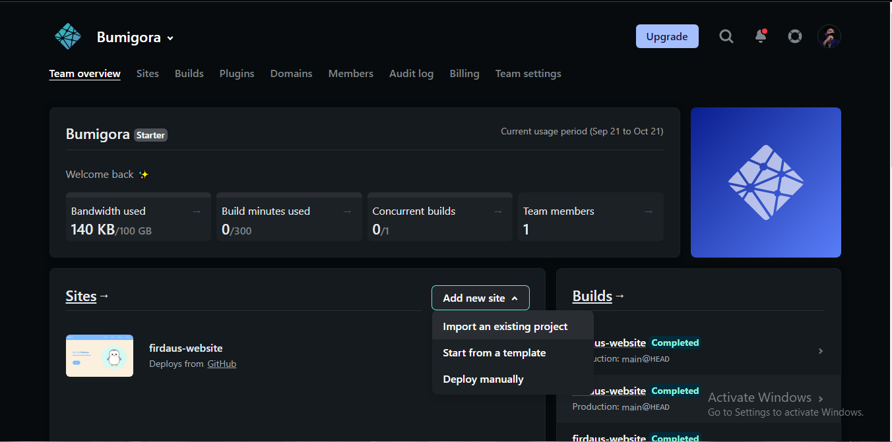
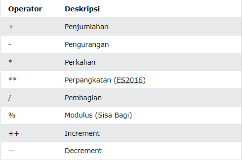
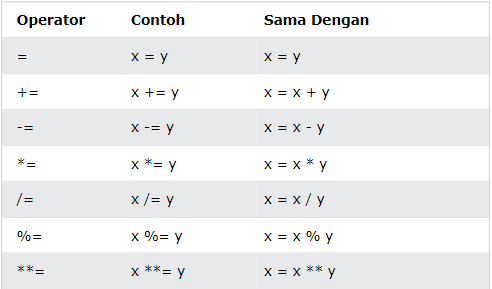
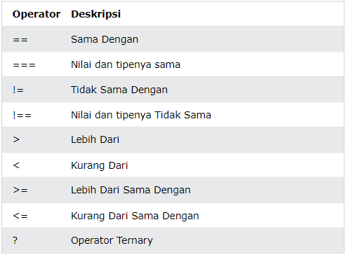
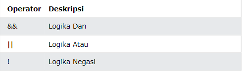

# Writing-and-Presentation-Test
1st Week

## HTML 

HTML adalah singkatan dari *Hyper Text Markup Language* merupakan sebuah bahasa komputer yang digunakan sebagai struktur atau kerangka dari sebuah website di internet. HTML biasanya digunakan untuk menampilkan konten pada browser. Contohnya seperti text, image, video, sound, link dan lain sebagainya.  

Tools utama yang digunakan untuk membuat HTML ada dua yakni code editor dan browser. Rekomendasi code editor yang bisa digunakan yakni Visual Studio Code dan rekomendasi browser yang digunakan yakni Google Chrome.  

Di dalam HTML sendiri memiliki tag-tag yang berfungsi sebagai kerangka utama di dalam HTML yakni < head> dan < body>. 
Berikut garis besar struktur dari HTML:
  
  

Semantic HTML merupakan cara penulisan HTML yang ddapat memudahkan developer untuk membaca struktur codingan HTML, mempermudah untuk diakses, lebih mudah dimaintain dan meningkatkan SEO. Berikut beberapa tag dari semantic HTML : 

* < article>  
* < aside>  
* < details>  
* < igcaption>  
* < figure>  
* < footer>  
* < header>  
* < main>  
* < mark>  
* < nav>  
* < section>  
* < summary>  
* < time>  
  
 Berikut contoh penggunaan tag semantic HTML :

 

Ketika sebuah file HTML sudah selesai dibuat dan ingin agar HTML yang telah dibuat bisa dilihat oleh banyak orang secara online bisa dengan men*deploy*nya dengan menggunakan github pages, netlify dan platform lainnya.  
Untuk mempermudah men*deploy* sebuah website di netlify kita harus sudah memiliki akun github yang sudah ada repositori yang memilik HTML di dalamnnya. Berikut langkah-langkah deploy website di netlify:  
1. Buka dan masuk dengan akun github ke dalam netlify.
2. berikan otorisasi netlify kepada github.
3. pilihlah repository yang ingin di*deploy* ke dalam netlify.
4. lakukan konfigurasi.
5. deploy website ke dalam netlify.

Jika sudah selesai men*deploy* maka akan tampak seperti berikut:  

## CSS
CSS adalah simgkatan dari Cascading Style Sheets merupakan bahasa yang digunakan untuk memperindah tampilan halaman website.
Css digunakan secara bersamaan dengan HTML untuk membuat sebuah website yang indah, menarik dan berfungsi dengan baik.

Untuk men*styling* HTML kita bisa menyisipkan CSS ke dalam file HTML. Ada 3 cara untuk menyisipkan CSS ke dalam HTML yakni dengan:  
* Embed
* Inline
* External
  
CSS memililki sintaks atau tata cara atau struktur penulisan kode yang harus diikuti agar dapat menampilkan sesuai dengan yang kita inputkan. Struktur dasarnya sebagai berikut :  
* Selector
* Declaration Blocks
* Properti dan Value
  
Berikut contohnya:   

Di dalam CSS ada yang namannya FlexBox. Flexbox adalah suatu cara untuk mengatur layout, posisi dan tampilan agar element child pada suatu container dapat beradaptasi dengan parent-nya. Berikut contoh dari flexbox :  

## Algoritma dan Struktur Data
Algoritma merupakan step-step atau langkah-langkah yang diperlukan untuk mencapai sesuatu atau menyelesaikan sebuah masalah. Sedangkan Struktur Data merupakan cara untuk menyimpaan dan mengatur data agar terstruktur pada suatu sistem atau database sehingga mudah untuk diakses. Berikut adalah contoh dari algoritma yang bisa ditemui dalam kehidupan sehari-hari: 
1. Apakah hari ini akan turun hujan?.
2. Jika tidak, maka saya tidak perlu membawa payung.
3. Jika iya, maka saya harus mencari payung.
4. Jika sudah menemukan payung, maka bawa payung.
5. Jika payung tidak ditemukan, pastikan kembali apakah masih hujan atau tidak, dan kembali ke poin 2 dan 3.

## JavaScript
Javascript adalah bahasa pemrograman yang digunakan dalam pengembangan website agar menjadi lebih interaktif dan dinamis. Dengan Javascript kita tidak hanya dapat membuat website menjadi lebih menarik, namun juga kita dapat memanfaatkan javascript untuk membuat tools, atau bahkan game di dalam web. Tag yang digunakan untuk menggunakan Javascript yakni dengan tag < script> dengan penampatan tag tersebut berada di dalam tag < body> HTML. Untuk mengecek apakah code javascript sudah benar atau belum, dengan cara klik kanan pada halaman dan inspect atau dengan menekan menekan F12. Lalu kita bisa melihatnya di console.  
Di dalam javascript ada yang namanya tipe data. Tipe data adalah klasifikasi yang dapaat kita berikan untuk berbagai macam data yang kita gunakan dalam programming. Secara fundamental, tipe data dibagi menjadi 6 yaitu:  
* number
* string
* boolean
* null
* undefined
* object  
  
Di dalam javascript juga memiliki operator, berikut beberap operator di dalam javascript:  
### Operator Aritmatika
  
### Assignment Operator 
  
### Operator Perbandingan

### Operator Logika
  

## Unix Command Line & Git and Github
Shell merupakan user interface yang memiliki tugas untuk memproses segala peritah yang diinputkan melalui CLI.
CLI atau Comman Line Interface adalah sebuah program yang membuat user dapat menginputkan perintah dalam bentuk teks dan memberikan instruksi pada sebuah komputer untuk mengerjakan tugas-tugas yang di instruksikan.
File system structures adalah struktur logika yang digunakan untuk mengatur akses data yang ada di dalam disk.
Git adalah singkatan dari Group Inclusive Tour merupakan sebuah software yang memiliki tugas untuk mencatat perubahan seluruh file pada suatu project. Sedangkan Github adalah sebuah layanan cloud yang berguna untuk menyimpan dan mengelola project-project yang dinamakan dengan repository.

Source :  
https://www.w3schools.com/  
https://medium.com/geekculture/5-ways-to-write-semantic-html-and-improve-webpage-seo-and-accessibility-626329130d95 (HTML)     
https://www.devmedia.com.br/css3-flexbox-funcionamento-e-propriedades/29532 (CSS)  

