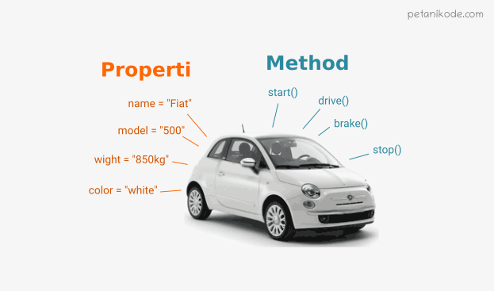

# Writing Test
3rd-Week
## Javascript - Array & Multidimensional Array
Learning Objectives:  
Peserta mampu memahami dan menggunakan struktur data Array     

Array adalah tipe data list order yang dapat menyimpan tipe data apapun di dalamnya, seperti tipe data String, Number, Boolean, dan lainnya. Dan cara untuk mendifinisikan sebuah array yaitu dengan menggunakan kurung siku `[]` .
 ````javascript
 let toDoList = ['Bangun jam 05.00', 'Olahraga','Mandi', 'Sarapan', 'Berangkat ke Kampus jam 08.00'];
 console.log(toDoList);
 ````
Array dihitung dari data pertama adalah index data ke-0.
 ````javascript
 let myArray = ["Ini Index 0", "Ini Index 1", "Ini Index 2", "Ini Index 3"];
 ````
Untuk mengakses data pada array kita bisa melakukannya dengan cara :
 ````javascript
 let myArray = ["Ini Index 0", "Ini Index 1", "Ini Index 2", "Ini Index 3"];
 console.log(myArray[1]); //mengakses index 1
 ````

Seperti tipe data dan variabel pada umumnya, kita dapat *mengupdate* data pada Array dengan cara:
 ````javascript
 let evenNumber = [1, 4, 6, 8];
 evenNumber[0] = 2;
 console.log(evenNumber);
 //output : [2, 4, 6, 8]
 ````

Const tidak bisa melakukan update data. Namun pada Array kita dapat melakukan update konten nilai di dalam array (mutable) dengan cara:
 ````javascript
 let myCars = ['BMW', 'Tesla', 'Mercedes'];
 myCars[1] = ['Wuling'];
 console.log(myCars);
 //output : ['BMW', 'Wuling', 'Mercedes']
 ````
Array memiliki built in methods untuk melakukan looping yang bernama .map() 
 ````javascript
 let doubled = myArray.map(num=>{
 return num*2;});
 ````
Multidimensional Array bisa dianalogikan sebagai array of array atau bahasa lebih mudahnya yakni ada array di dalam array.  
 ````javascript
 let tas = [
 ['baju bola',2],
 ['kaos partai', 1],
 ['hoodie keren',3],
 ['sepatu futsal',2],
 ];
 console.log(tas[1][0]); //output kaos partai
 ````
Sama seperti array satu dimensi, multidimensional array juga dapat menggunakan Property dan Method built-in Array.
## Javascript - Object & Array Object
Learning Objectives:  
Peserta mampu memahami dan menggunakan struktur data Object  
Peserta mampu memahami dan menggunakan struktur data Array of Objects  

Object adalah sebuah tipe data pada variabel yang menyimpan properti dan fungsi (method).  
Properti adalah data lengkap dari sebuah object.   
Method adalah action dari sebuah object. Apa saja yang dapat dilakukan dari suatu object.  

  
Sama seperti tipe data sebelumnya. Object dapat diassigndimasukkan) kedalam sebuah variabel.
 ````javascript
 let manusia = {
   nama: 'Firdaus',
   kota: 'Mataram',
   umur: 20
 }
 ````
berikut cara mengakses object dan propertinya:
````javascript
 let manusia = {
   nama: 'Firdaus',
   kota: 'Mataram',
   umur: 20
 }
 console.log(manusia); //mengakses object secara keseluruhan
 console.log(manusia.nama); //mengakses properti dari object
 console.log(manusia['nama']); //mengakses properti dari object
 ````
Kita dapat melakukan update dan menambahkan data baru pada variabel dengan tipe data Object.
 ````javascript
let manusia = {
   nama: 'Firdaus',
   kota: 'Mataram',
   umur: 20
 }
 manusia.umur = 17; //update value dari sebuah key
 manusia.hobi = 'gaming'; //menambahkan key dan value baru 
 console.log(manusia)
 // output
//     {
 //    nama: 'Firdaus',
 //    kota: 'Mataram',
 //    umur: 20,
 //    hobi: 'gaming'
 //    }
 ````
Kita juga dapat menghapus properti dari object menggunakan delete operator.  
 ````javascript
 let manusia = {
   nama: 'Firdaus',
   kota: 'Mataram',
   umur: 20,
   hobi: 'gaming'
 }
 delete manusia.hobi;
 console.log(manusia)
 // output
//     {
 //    nama: 'Firdaus',
 //    kota: 'Mataram',
 //    umur: 20
 //    }
 ````
Jika value yang kita masukkan pada property berupa function, maka itulah yang disebut dengan method.
````javascript
 const greeting = {
    welcome: function(){
        return 'Selamat datang';
    },
    afterTransaction: function(){
        return 'Terima kasih sudah datang';
    },
 };
 console.log(greeting.welcome()); //output: Selamat datang
````
Pada real application kita pasti menemukan data object yang kompleks.Object yang berasal dari turunan object lainnya, seperti berikut:
````javascript
const news = {
	title: 'Firdaus, seorang pemuda yang berhasil menamatkan kelas Skilvul',
	description : 'Pemuda yang sangat luar biasa ini ternyata adalah...',
	author:{
		people:{
			name: 'Jhon Watson',
			age : 28,
			city: 'Birmingham, UK',
		}
	}
};
console.log('News:', news.title);
console.log('Article published by', news.author.people.name);
//output
// 'News: 'Firdaus, seorang pemuda yang berhasil menamatkan kelas Skilvul'
// 'Article published by Jhon Watson'
````
Di dalam object, ada array juga, contohnya seperti berikut:
````javascript
let students = [
	{
		name:'Firdaus Kuncoro'
		age: 17,
		isVerified: true,
	},
	{
		name:'Sherlock Holmes'
		age: 35,
		isVerified: true,
	}
];
students.forEach((listStudent)=>{   
	console.log(listStudent);
});//Gunakan forEach apabila object didalam array
````

## Javascript - Rekursif 
Learning Objectives:  
 Peserta mampu memahami dan membuat program Rekursif   

Rekursif adalah function yang memanggil dirinya sendiri sampai kondisi tertentu terpenuhi. Recursive kebanyakan digunakan untuk case matematika, fisika, kimia, dan yang berhubungan dengan perhitungan.  

Berikut struktur dasar rekursif:
````javascript
function recursive () {
  //..
  recursive();
  //..    
}
````
Sebuah rekursif yang memiliki sebuah kondisi, disini rekursif akan berhenti memanggil dirinya sendiri jika kondisi terpenuhi.

````javascript
function recursive (){
  if (condition){
      //stop calling itself
      //..
  }else {
          recursive();        
  }
}
````
Rekursif memiliki ciri-ciri yakni:
* Fungsi rekursif selalu memiliki kondisi yang menyatakan kapan fungsi tersebut berhenti. Kondisi ini harus dapat dibuktikan akan tercapai, karena jika tidak tercapai maka kita tidak dapat membuktikan bahwa fungsi akan berhenti, yang berarti algoritma kita tidak benar.
* Fungsi rekursif selalu memanggil dirinya sendiri sambil mengurangi atau memecahkan data masukan setiap panggilannya. Hal ini penting diingat, karena tujuan utama dari rekursif ialah memecahkan masalah dengan mengurangi masalah tersebut menjadi masalah-masalah kecil.  
Berikut contoh penggunaan rekursif:
````javascript
function countdown(i) {
  console.log(i);
  if (i <= 0) {
    return;
  } else {
    countdown(i - 1);
  }
}
countdown(10);
````
## Javascript - Asynchronous(Introduction & Promise)
Learning Objectives:  
Peserta mampu memahami dan memanipulasi data menggunakan Web Storage    

Asynchronous yang biasa dikenal juga dengan sebutan non-blocking mengizinkan komputer kita untuk memproses perintah lain sambil menunggu suatu proses lain yang sedang berlangsung. Ini artinya kita bisa melakukan lebih dari 1 proses sekaligus (multi-thread). Eksekusi perintah dengan asynchronous tidak akan melakukan blocking atau menunggu perintah sebelumnya selesai. Jadi sambil menunggu kita bisa mengeksekusi perintah lain.  
Di dalam asynchronous adayang namanya *callback*, *promise* dan *async/await*.  

### Callback  
Callback adalah sebuah function, namun bedanya dengan function pada umumnya adalah pada cara eksekusinya. Jika function pada umumnya dieksekusi secara langsung, sedangkan callback dieksekusi di dalam function lain melalui parameter.
````javascript
function proses1() {
  console.log("Ini adalah proses 1");
}

function proses2(callback) {
  setTimeout(function () {
    console.log("Ini adalah proses 2");
    callback();
  }, 100);
}

function proses3() {
  console.log("Ini adalah proses 3");
}
proses1();
proses2(proses3);

/*
Hasil Output
Ini adalah proses 1
Ini adalah proses 2
Ini adalah proses 3
*/
````
### Promise
Promise sesuai dengan artinya adalah janji. Seperti ketika kita berjanji, jika apa yang kita janjikan bisa kita lakukan maka kita harus melakukannya, jika janjinya ada halangan maka kita tidak bisa melakukannya atau jika janji tersebut belum pada waktunya kita juga harus menunggunya.  
Ketika data sedang di proses, promise memiliki 3 status yakni:
* pending, jika data sedang diproses.
* fulfilled, jika data telah berhasil didapatkan.
* rejected, jika data gagal didapatkan.
Berikut struktur dasar promise:
````javascript
new Promise(function (resolve, reject) { ... } );
````
Berikut contoh dari promise:
````javascript
function myDisplayer(some) {
  document.getElementById("try").innerHTML = some;
}

let myPromise = new Promise(function(myResolve, myReject) {
  let x = 0;

// The producing code (this may take some time)

  if (x == 0) {
    myResolve("OK");
  } else {
    myReject("Error");
  }
});

myPromise.then(
  function(value) {myDisplayer(value);},
  function(error) {myDisplayer(error);}
);
````
### Async/await
Async/await adalah sebuah syntax khusus yang digunakan untuk menangani Promise agar penulisan code lebih efisien dan rapih. 
Sebuah async function bisa tidak berisi await sama sekali atau lebih dari satu await. Keyword await hanya bisa digunakan didalam async function, jika digunakan di luar async function maka akan terjadi error.  
Berikut contoh penggunaan async:
````javascript
async function tesAsyncAwait() {
  return "Fulfilled";
}

console.log(tesAsyncAwait());
````


## Javascript - Web Storage
Learning Objectives:  
Peserta mampu memahami dan memanipulasi data menggunakan Web Storage   

Ada beberapa cara untuk menyimpan data pengguna seperti pencarian, artikel berita, dan lain-lain ke lokal (browser) menggunakan web storage seperti cookies, local storage, dan session storage. Data ini dimanfaatkan oleh situs web tersebut untuk merekam kebiasaan pengguna agar dapat memberikan rekomendasi sesuai preferensi si pengguna tersebut. Untuk saatini yang biasa digunakan adalah Local Storage dan Session Storage.
Dengan memanfaatkan local storage dan session storage, kita dapat menyimpan data lebih besar yaitu 5MB per page tanpa mempengaruhi kinerja situs web. Namun, penting untuk diketahui agar kita tidak menyimpan data sensitif seperti password ke dalam local storage ataupun session storage untuk menghindari serangan pencurian data.  
Local storage memiliki karakteristik sebagai berikut:

* Menyimpan data tanpa tanggal kadaluarsa.
* Data tidak akan dihapus ketika web browser ditutup dan akan tersedia seterusnya selama kita tidak menghapus data local storage pada web browser.
* Dapat menyimpan data hingga 5MB.
* Hanya dapat menyimpan data string.  
  
Untuk mengambil data yang telah tersimpan pada local storage, kita dapat menggunakan method getItem() yang membutuhkan 1 parameter. Parameter tersebut adalah key dari data yang kita inginkan. 
````javascript
localStorage.getItem('key');
````
Sedangkan untuk menghapus data yang telah tersimpan pada local storage, kita dapat menggunakan method removeItem() yang membutuhkan 1 parameter. Parameter tersebut adalah key dari data yang ingin kita hapus.

````javascript
// menghapus key tertentu
localStorage.removeItem("key");

// menghapus semua key
localStorage.clear();
````

Session storage mempunyai beberapa karakteristik, yaitu:

* Data yang disimpan pada session storage akan terus tersimpan selama browser terbuka dan tidak hilang jika laman di-reload.
* Membuka banyak tab/window dengan URL yang sama, akan menciptakan session storage yang berbeda di masing-masing tab/window.
* Menutup tab/window akan mengakhiri session dan menghapus data yang tersimpan di session storage pada tab/window tersebut.
* Data yang tersimpan dalam session storage harus berbentuk string.
* Hanya dapat menyimpan data sebanyak 5MB.  

Sama seperti local storage, cara mendapatkan data dari session storage juga menggunakan getItem(), seperti berikut ini:
````javascript
// mendapatkan session storage
sessionStorage.getItem('key');
````
Syntax untuk menghapus data dari session storage ada 2, yaitu:
````javascript
// menghapus session storage satu persatu berdasarkan key
sessionStorage.removeItem('key');

// menghapus seluruh session storage sekaligus
sessionStorage.clear();
````

Source:   
https://www.petanikode.com/  
https://skilvul.com/