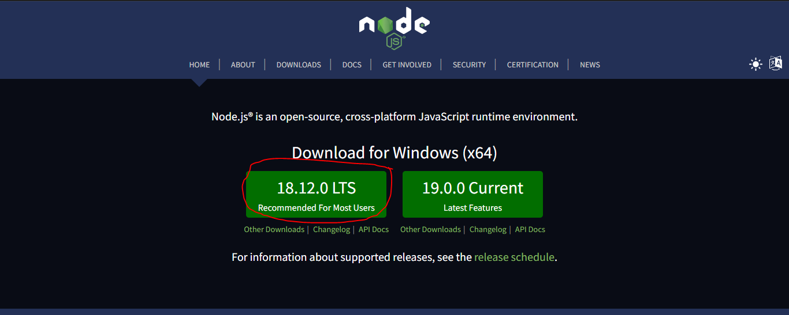
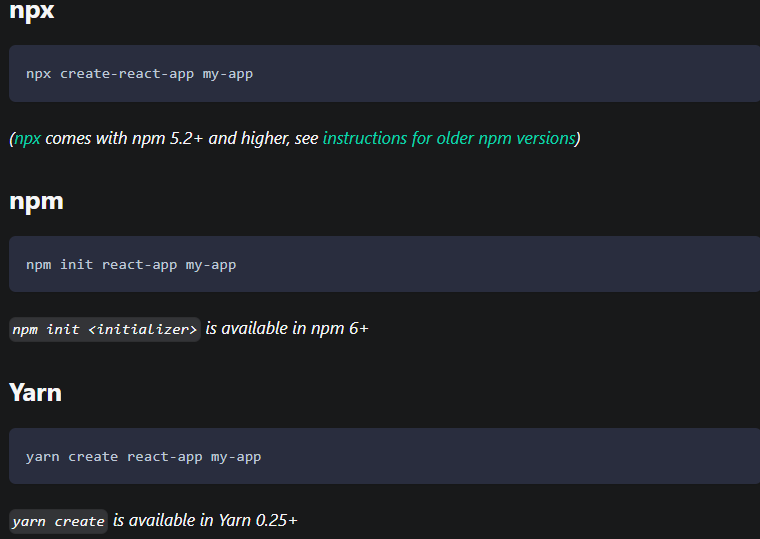
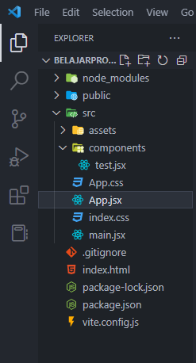
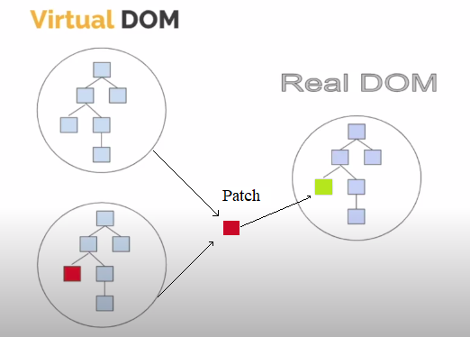
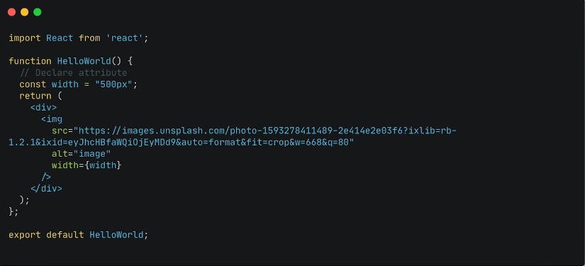
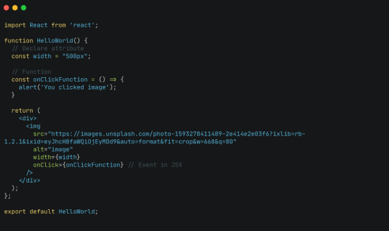
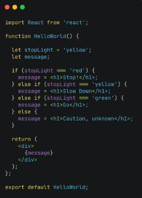
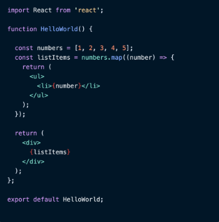
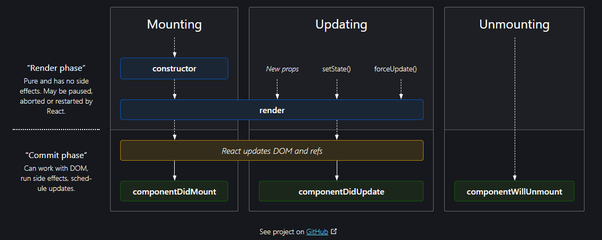

# Writing Test
6th-Week
## Intro to React.js, Virtual DOM, and JSX
React.js adalah sebuah library javascript yang digunakan untuk mempermudah membuat tampilan (User Interface) pada website.  

Untuk menggunakan React.js, pertama-tama kita perlu download dan install node.js terlebih dahulu melalui link https://nodejs.org/en/ .

Selanjutnya install react dengan mengetikkan salah satu dari command berikut.   



Create React App pun sudah terinstall dan bisa langsung digunakan.  

  
Untuk memulai, kita bisa menggunakan file yang bernama "App.jsx".

JSX adalah extension syntax JavaScript yang memungkinkan Anda untuk memodifikasi Document Object Model (DOM) dengan kode bergaya HTML. JSX perlu dicompile untuk menjadi Javascript. Sehingga sebelum ditampilkan pada browser, JSX akan dicompile menjadi Javascript terlebih dahulu. Dengan JSX kita dapat menggunakan HTML di dalam file extension Javascript (.js).  
* ### JSX Rules
    Setiap JSX hanya dapat memiliki satu parent element.
* ### The Virtual DOM
    Virtual DOM adalah salinan dari real DOM yang akan diupdate.
  
* ### class dan className
    Pada JSX attribut class di tag element HTML harus menggunakan className
* ### Curly Braces in JSX
    Kita dapat menggunakan syntax Javascript di alam element HTML dengan curly braces.
* ### Variable pada JSX  
    Kita dapat menggunakan curly braces untuk mengakses variable pada JSX.
* ### Attribute pada JSX  
  
* ### Event pada JSX
  
* ### Conditional pada JSX  
  
* ### .map pada JSX  
  
  
Di dalam React ada yang namanya component.
Component adalah potongan kode kecil yang dapat di gunakan kembali (reusable) agar user interface terpisah menjadi bagian-bagian kecil sehingga dapat di satukan dan di render menjadi sebuah kode HTML.
Untuk membuat component ada dua cara yakni menggunakan function dan class. Umumnya yang direkomendasikan yakni menggunakan function.
* #### function
    ````javascript
    function Greetings(){
        return <h1>Halo Dunia!</h1>
    }
    <Greetings />
    ````
* #### class

    ````javascript
    class Greetings extends React.Component {
    render(){
            return (
            <div>
                <h1>Hello World!</h1>
            </div>
            )
        }
    }
    <Greetings />
    ````
### Props & State
props (kependekan dari “properti”) dan state adalah objek JavaScript biasa. Meskipun keduanya menyimpan informasi yang mempengaruhi keluaran dari render, keduanya berbeda satu sama lain, props diteruskan ke komponen (mirip dengan function parameters) sedangkan state dikelola dalam komponen (mirip dengan variabel yang dideklarasikan dalam suatu function). Atau bahasa lebih mudahnya yakni State adalah data lokal. Sedangkan Props itu digunakan agar component memiliki data yang dinamis yang dikirim dari component lain.

### Lifecycle
Component di dalam react akan mengalami tiga fase, yakni mounting, updating dan unmounting.

* #### Mounting
    Mounting merupakan fase ketika component dibuat atau di-render pertama kali ke DOM. componentWillMount adalah method yang akan di eksekusi pertama kali, kemudian akan mengeksekusi method render.
    Di dalam method render inilah kita menyimpan file JSX yang nantinya akan di render ke DOM.
    Setelah method render di eksekusi baru kemudian mengeksekusi method componentDidMount. Akses dan manipulasi DOM di lakukan pada method ini, operasi lain seperti request data dari API semuanya dilakukan di sini.
* #### Updating
    Updating merupakan fase ketika sebuah component di-render ulang, biasanya terjadi ketika ada perubahan pada state atau props yang  mengakibatkan perubahan DOM. 
    Pada fase ini ada lima method yang akan dijalankan, yakni :
    * componentWillReceiveProps : fungsi ini akan di eksekusi bila state yang ada di component akan di update atau di ubah dengan nilai props yang baru.
    * shouldComponentUpdate : tugasnya adalah untuk menentukan apakah sebuah component akan di render ulang atau tidak.Method ini akan mengembalikan nilai boolean true & false, jika true maka component akan di render ulang atau sebaliknya.
    * componentWillUpdate : fungsi ini akan di eksekusi jika fungsi shouldComponentUpdate mengembalikan nilai true.
    * Kemudian kembali method render akan di jalankan
    * componentDidUpdate : fungsinya sama dengan componentDidMount yaitu untuk manipulasi DOM dan request data.  
* #### Unmounting
    Unmounting merupakan fase ketika component dihapus dari DOM. Pada fase ini hanya ada satu method yang akan di eksekusi yaitu componentWillUnmount, yang di jalankan sebelum sebuah component di hapus dari DOM.  
### Styling React
Styling di React sama saja seperti styling pada HTML biasa. Contohnya kurang lebih seperti berikut:
* JSX
    ````javascript
    import React from 'react';
    import avatar from'./assets/user-avatar.jpg';
    import './App.css';

    function App(){
        return(
            <div>
                <div className="containerStudent">
                    const Avatar = ()=>{
                        return(
                            <div>
                                
                            </div>
                        )
                    }
                    <Avatar />
                </div>
            </div>
        );
    }
    export default App;
    ````
* CSS
    ````css
    .avatar{
        width: 150px;
        height: 150px;
        overflow: hidden;
        border-radius: 100%;
        object-fit: cover;
    }
    .containerStudent{
        display: flex;
        justify-content: center;
        margin-top: 100px;
    }
    ````