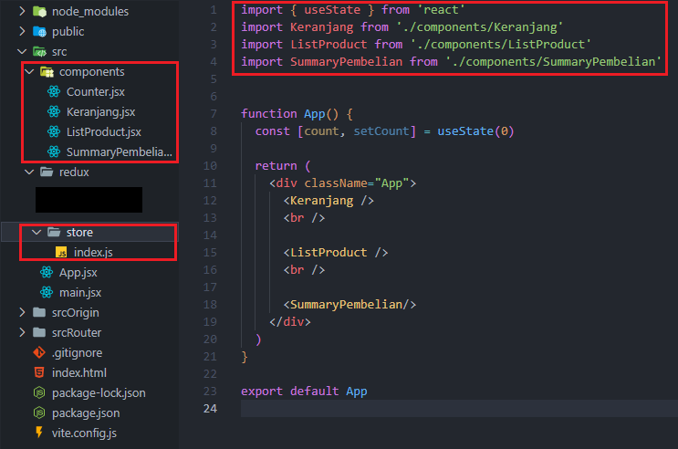
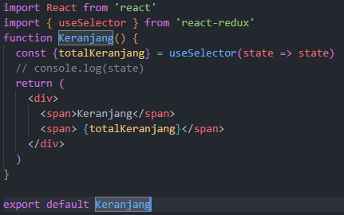
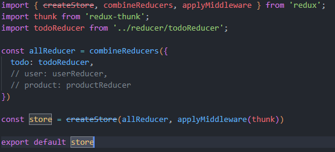

# Writing Test
7th-Week

## Prop Types
Prop types merupakan sebuah library yang dapat membantu seorang developer untuk memeriksa data props yang dikirim agar sesuai dengan yang diinginkan.   
Jika tidak sesuai, maka akan muncul pesan error.    
    Untuk menginstallnya ke dalam project kita dengan memasukkan kode berikut.  
````
npm install prop-types
````  
Jika sudah terinstall, maka kita bisa mengimportnya ke dalam project kita, berikut contohnya:  

 ````javascript
import PropTypes from 'prop-types';
function Header(props) {
    return(
        <>
        <h2>Nama: {props.name}</h2>
        <h2>Umur: {props.age}</h2>
    )
}
Header.propTypes={
    name: PropTypes.string,
    age: PropTypes.number
}
````
dan akan muncul error seperti berikut:

Jika error tersebut muncul pada saat development maka kita perlu memeriksa kembali codingan yang kita tulis.

## React Router
React Router digunakan untuk menentukan beberapa rute dalam aplikasi. Saat pengguna mengetik URL tertentu ke browser, dan jika jalur URL ini cocok dengan ‘rute’ apa pun di dalam file router, pengguna akan diarahkan ke rute tersebut.  
Routing merupakan sebuah proses pengguna diarahkan ke halaman yang berbeda berdasarkan inputan atau permintaan mereka.  
Secara konsep, routing ini mirip dengan tag ````<a>```` pada HTML.  
Untuk menginstallnya kita bisa memasukkan command berikut ke dalam folder project kita.  
    ````
    npm install react-router-dom@6
    ````  
Setelah installasi berhasil, kita import BrowserRouter ke dalam file main.jsx. Component App akan kita bungkus dengan BrwoserRouter agar component App dapat melakukan routing.  


setelah itu, kita buat folder Pages di dalam folder src sebagai penampung untuk file halaman yang akan kita gunakan. Juga import router dom ke dalam file App.
  

Lalu, kita masukkan perintah untuk melakukan perpindahan halaman di dalam component App. Component Route memiliki fungsi yang mirip dengan tag ````<a>```` pada HTML. untuk element mirip dengan tag href pada HTML. dan untuk path memiliki fungsi penamaan pada url dari halaman yang dituju.
````javascript
const App = () => {
  return (
    <>

    <Routes>
      <Route path="/" element={<HomePage/>}/>
      <Route path="/about" element={<AboutPage/>}/>
    </Routes>

    </>
  );
};
````
selanjutnya, kita akan membuat navbar dengan menggunakan link. Link memiliki fungsi yang mirip dengan tag ````<a>```` pada HTML. dan to mirip dengan href pada HTML.
````javascript
 <Routes>
      <Route path="/" element={<HomePage/>}/>
      <Route path="/about" element={<AboutPage/>}/>
    </Routes>

    <nav>
      <Link to={"/"}>Home</Link>
      <Link to={"/about"}>About</Link>
    </nav>
````   
dan hasilnya akan menjadi seperti ini.  
  

* ### Nested Route
    Nested route adalah route di dalam route.  
    cara membuatnya:
    ````javascript
    {/* penggunaan nested route */}
    <Route path="/about" element={<AboutPage />}>
        <Route path="student" element={<AboutStudent />} />
        <Route path="teacher" element={<AboutTeacher />} />
        <Route index element={<AboutSchool />} />
    </Route>
    ````  
    Di sini AboutPage menjadi induk bagi AboutStudent dan AboutTeacher, dan index mengartikan bahwa component AboutSchool menjadi component yang akan pertama kali muncul.  
    berikutnya, di AboutPage yang menjadi induk dari nested route, kita import Outlet.   
      

## React Redux
Redux adalah salah satu state management yang sangat populer digunakan di reactjs. Dengan redux kita akan punya state yang bisa dishare di seluruh aplikasi, menggunakan middleware dan masih banyak lagi.  

Ada tiga prinsip utama redux, yakni :
  * State adalah single-source-of-truth atau semua data state yang ingin dishare hanya ada dan bersumber dari state. 
  * State tidak bisa diubah begitu saja, kita perlu menggunakan bantuan action untuk memanipulasi state. 
  * Manipulasi state dibuat dengan pure function, sebuah fungsi yang melakukan tugas tanpa efek samping.
  
* untuk menginstall redux kita bisa menggunakan command
````npm install redux react-redux````
* setelah itu, buat component yang dibutuhkan dan mengimportnya di component App juga membuat folder store sebagai gudang menyimpan data.    
    
    
* lalu buat juga reducer sebagai rak penyimpan data.  
    
* mendeklarasikan store di main.jsx menggunakan provider agar store dapat digunakan.  
  
* setelah itu kita dapat mengambil data dari store menggunakan useSelector  
  
* lalu kita membuat file action yang berguna untuk merubah data  
  
* untuk mengubah data kita bisa menggunakan useDispatch  
  

### ReduxThunk
Redux Thunk adalah middleware yang memungkinkan Anda memanggil pembuat aksi yang mengembalikan fungsi sebagai ganti objek aksi. Fungsi itu menerima metode pengiriman penyimpanan, yang kemudian digunakan untuk mengirim aksi sinkron di dalam isi fungsi setelah operasi asinkron selesai.
cara menginstall redux thunk menggunakan command  
 ````npm install redux-thunk@2.3.0````
setelah menginstallnya kita bisa mengimportnya di dalam store  
