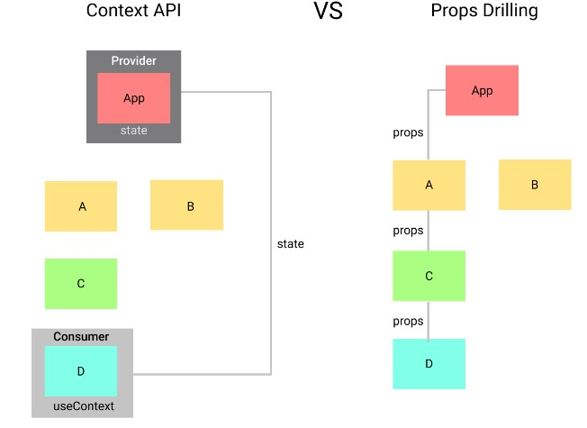

# Writing Test

8th-Week

## React Context

React context merupakan sebuah cara untuk membuat global state yang nanti bisa digunakan di semua level komponen tanpa harus mengirim props ke lower level component secara manual. React context ini merupakan alternatif dari props drilling. Props drilling sendiri adalah cara mempassing props dari grandparent ke parent ke child ke grandchild dan seterusnya.



untuk menginstall React Context kita bisa menggunakan command:

> ```
> npm install react-context --save
> ```
>
> Setelah menginstall kita bisa menggunakannya di aplikasi react kita  
> PART 1
> App.jsx

```javascript
import React from "react";
import "./styles.css";
import CountContainer from "./components/CountContainer";
import Count from "./components/Count";

export default function App() {
  return (
    <div className="container">
      <CountContainer>
        <Count />
      </CountContainer>
    </div>
  );
}
```

Component/CountContainer.jss

```javascript
import React from "react";
import { useCountContext } from "../context";

const CountContainer = ({ children }) => {
  const { toggle, handleTheme } = useCountContext();
  return (
    <>
      <div className="count-wrapper">{children}</div>
      <button className="btn">Change Theme</button>
    </>
  );
};
export default CountContainer;
```

Component/Count.jsx

```javascript
import React from "react";

const Count = () => {
  return (
    <>
      <h1>{count}</h1>
      <div>
        <button className="btn">-</button>
        <button className="btn">Reset</button>
        <button className="btn">+</button>
      </div>
    </>
  );
};

export default Count;
```

PART 2
context.jsx

```javascript
import React, { useState, createContext, useContext } from "react";
const CountContext = createContext();
export const CountProvider = ({ children }) => {
  return <CountContext.Provider>{children}</CountContext.Provider>;
};
```

Context.jsx

```javascript
import React, { useState, createContext, useContext } from "react";

const CountContext = createContext();

export const CountProvider = ({ children }) => {
  const [count, setCount] = useState(0);
  const [toggle, setToggle] = useState(false);
  return (
    <CountContext.Provider
      value={{ count: [count, setCount], toggle: [toggle, setToggle] }}
    >
      {children}
    </CountContext.Provider>
  );
};
```

Context.jsx

```javascript
import React, { useState, createContext, useContext } from "react";

const CountContext = createContext();

export const useCountContext = () => {
  const context = useContext(CountContext);
  const [count, setCount] = context.count;
  const [toggle, setToggle] = context.toggle;

  const handleCount = (number) => {
    if (number === 0) {
      setCount(0);
    } else {
      setCount((c) => c + number);
    }
  };

  const handleTheme = () => {
    setToggle((prev) => !prev);
  };

  return {
    handleCount,
    count,
    handleTheme,
    toggle,
  };
};

export const CountProvider = ({ children }) => {
  const [count, setCount] = useState(0);
  const [toggle, setToggle] = useState(false);
  return (
    <CountContext.Provider
      value={{ count: [count, setCount], toggle: [toggle, setToggle] }}
    >
      {children}
    </CountContext.Provider>
  );
};
```

PART 3
index.jsx

```javascript
import React from "react";
import ReactDOM from "react-dom";

import App from "./App";
import { CountProvider } from "./context";

const rootElement = document.getElementById("root");
ReactDOM.render(
  <React.StrictMode>
    <CountProvider>
      <App />
    </CountProvider>
  </React.StrictMode>,
  rootElement
);
```

components/CountContainer.js

```javascript
import React from "react";
import { useCountContext } from "../context";

const CountContainer = ({ children }) => {
  const { toggle, handleTheme } = useCountContext();
  return (
    <>
      <div
        className="count-wrapper"
        style={{ background: toggle ? "#f56161" : "#7fee5d" }}
      >
        {children}
      </div>
      <button className="btn" onClick={handleTheme}>
        Change Theme
      </button>
    </>
  );
};
export default CountContainer;
```

components/Count.js

```javascript
import React from "react";
import { useCountContext } from "../context";

const Count = () => {
  const { count, handleCount } = useCountContext();
  return (
    <>
      <h1>{count}</h1>
      <div>
        <button className="btn" onClick={() => handleCount(-1)}>
          -
        </button>
        <button className="btn" onClick={() => handleCount(0)}>
          Reset
        </button>
        <button className="btn" onClick={() => handleCount(1)}>
          +
        </button>
      </div>
    </>
  );
};
export default Count;
```  

### React Context with useReducer

## React Testing
React Testing  adalah seperangkat pembantu yang memungkinkan kita untuk mengetes komponen pada React tanpa bergantung pada detail implementasinya. Pendekatan ini membuat refactoring menjadi mudah dan juga mendorong kita untuk menerapkan best practices untuk aksesbilitas. 

Pengujian adalah proses memverifikasi bahwa test assertions kita benar dan bahwa mereka tetap benar sepanjang masa aplikasi. Test assertion ini adalah ekspresi boolean yang mengembalikan nilai true kecuali ada bug di kode kita.

Misalnya, asersi bisa menjadi sesuatu yang sederhana seperti ini: "Ketika pengguna menavigasi ke / login, modal dengan id #login harus dirender." Jadi, jika ternyata kita mengacaukan komponen masuk entah bagaimana, asersi akan kembali salah. Asersi tidak hanya terbatas pada apa yang diberikan — kita juga dapat membuat asersi tentang bagaimana aplikasi merespons interaksi pengguna dan tindakan lain.

Ada banyak strategi pengujian otomatis yang digunakan oleh pengembang front-end untuk menguji kode mereka. KIta akan membatasi diskusi kita hanya dengan tiga paradigma uji perangkat lunak yang populer dengan React: pengujian unit, pengujian fungsional, dan pengujian integrasi.

Jest adalah kerangka pengujian yang memerlukan konfigurasi nol dan karenanya mudah disiapkan. Ini lebih populer daripada kerangka uji seperti Jasmine dan Mocha karena dikembangkan oleh Facebook. Jest juga lebih cepat daripada yang lain karena menggunakan teknik cerdik untuk memparalelkan uji coba lintas pekerja. Selain itu, setiap tes berjalan di lingkungan sandbox untuk menghindari konflik antara dua tes berurutan.

Untuk menginstall Jest kita bisa menggunakan comand:
````
npm i jest --save-dev
````

setelah itu kita bisa mencoba untuk jest dengan membuat aplikasi calculator  
````javascript
export const fungsiTambah = (x,y) => {
return x+y;
}
````
````javascript
import {fungsiTambah} from ‘./Calculator’
test(‘Calculator.jsx Unit Test’, () => {
const nilai = fungsiTambah(2,3)
expect(nilai).toEqual(2+3);
})
````
lalu kita bisa melakukan testnya speerti berikut
````javascript
test(‘Nama fungsi testing ‘, () => {
kode untuk melakukan testing
})
````
````javascript
test(‘Calculator.jsx Unit Test’, () => {
expect(add(2,1)).toEqual(3);
})
````
````javascript
test(‘Calculator.jsx Unit Test’, () => {
const nilai = fungsiTambah(2,4)
expect(nilai).toEqual(2+3);
})
````
